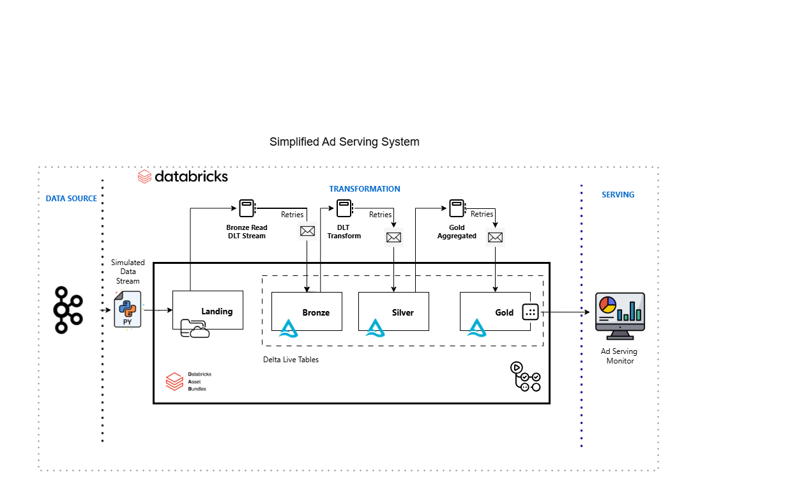

# ad_monitor

Ad monitoring Service Project

## Getting started
Project is confugured with DevContainers, all dependencies are installed automatically upon load.
All project documents have also been attached to this repository.



You can follow these commands to setup manually:

1. Setup uv:
    ```
    $ pip install uv
    ```

2. Install dependies and activate venv:
    ```
    $ uv sync %% source .venv/bin/activate # .venv/Scripts/activate for windows
    ```

3a. Install databricks cli:
    ```
    $ curl -fsSL https://raw.githubusercontent.com/databricks/setup-cli/main/install.sh | sh
    ```

3b. Configure your workspace:
    ```
    $ databricks configure
    ```
This command will ask for the Host URL and Personal Asset Token from Databricks

4. Login to a profile:
    ```
    $ databricks auth login --profile <profile-name>
    ```

5. Validate and retrieve Dashboard state:
    ```
    $ make validate
    ```

6. Deploy to environment:
    ```
    $ make deploy
    ```
